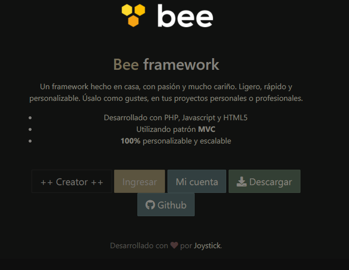
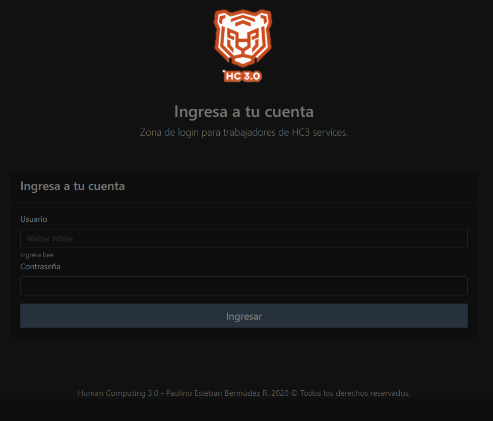

# Proyecto de sistema médico sencillo con Bee Framework.

    En este proyecto se ha hecho uso del framework Bee, con el fin de desarrollar las bases del funcionamiento del mismo.  
    Este framework está desarrollado con PHP, Jaavscript y HTML5.  
    Usa el patrón MVC y es a su vez escalable y personalizado.
    

            
    

    El proyecto se desarrolla siguiendo el esquema de 3 tareas principales:
    <ul>
        <li>Recibir consultas</li>
        <li>Dar respuesta a las citas con mensajes de texto y archivos adjuntos</li>
        <li>Proteger la informacion con sesiones privadas de los doctores del sistema</li>
    </ul>
    Estos tres proyectos unidos a uno se desarrollaron en este trabajo, llamado 'HUMAN COMPUTING MEDICAL SERVICES'. 
     
    

            
    

    #PHP , #JS , #MYSQL , #HTML5 , #CSS3 #SASS  
    #BEE #FRAMEWORK #POO  
    Patrón de desarrollo #MVC  
         
    @chunche95  
    @pauchino09  
    Paulino Esteban Bermúdez R.  
